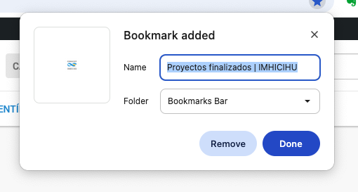
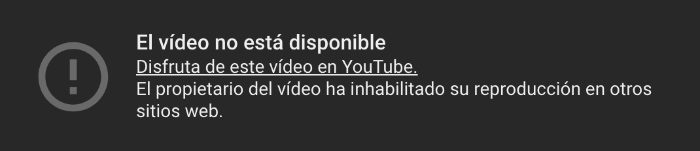
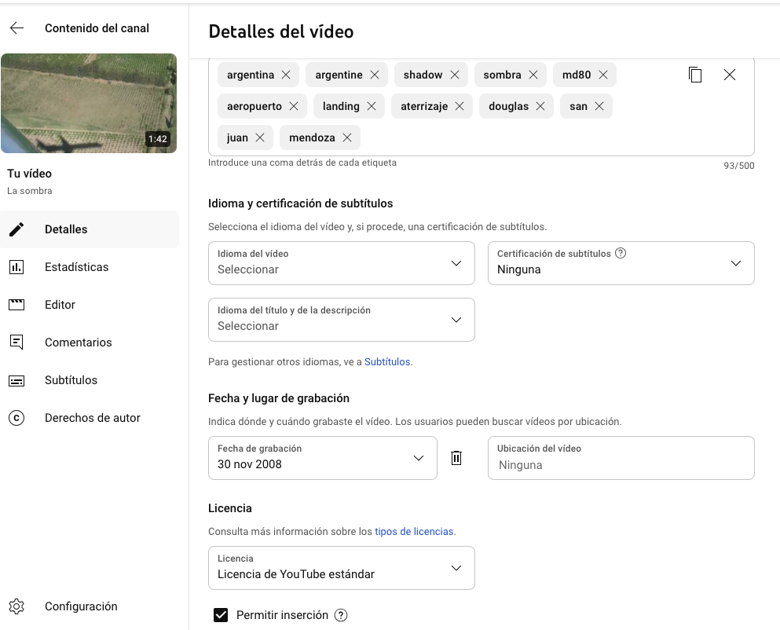
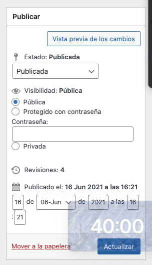

Hecho

* [x] Se deshabilitó `Deshabilitar las Noticias locales en la página de inicio (Inglés)`
* [x] `Geodemos` section uploaded
* [x] ~~sitemap generated (obfuscated!)~~
* [x] Renombrar ~~`Papers`~~ a `Publicaciones` 
* [x] `Seminarios` actualizado
* [x] `Papers` actualizado
* [x] se quitó `Noticias` del `main header`
* [x] `Seminarios` actualizado
* [x] Novedades section updated
* [x] Sección `Historia` actualizado
* [x] Sección `Publicaciones` actualizado
* [x] Sección `Objetivos` actualizado
* [x] Sección `Autoridades` actualizado
* [x] Sección `Repositorio digital` actualizado
* [x] Updated digital collections section
* [x] Sección `Convenios` actualizado
* [x] added `Tesis doctorales` actualizado with brand new text & link
* [x] Sección `Colección digital`
	* [X] Informes de investigación (PREP) (navigation fixed)
	* [x] Praehistoria (navigation fixed)
	* [x] Geodemos (updated) (navigation fixed)
	* [x] REE (navigation fixed)
	* [x] Temas Medievales (navigation fixed)
* [x] Agregado [Repositorio institucional](https://ri.conicet.gov.ar/handle/11336/458/discover) a redes sociales 
* [x] menú `Institucional` actualizado
* [x] Menú superior `Investigación` se cambió a `Líneas de investigación`
* [x] El sub-elemento del menú superior `Líneas de investigación` se cambió de `Líneas de investigación` a `Areas de investigación`
* [x] El sub-elemento del menú superior `Líneas de investigación` se cambió de `Proyectos` a `Proyectos vigentes`
* [x] Últimas incorporaciones del Repositorio Institucional. Ingresar el NÚMERO de la colección correspondiente del listado: https://ri.conicet.gov.ar/community-list --> https://ri.conicet.gov.ar/handle/11336/458/discover
* [x] Formulario Dr. Bórmida & Libretas (updated)\ table formatting to 64px --> applied
	* [x] formulario original source code --> look 4! CognitoForms --> fixed
* [x] All previous digital collections (pdfs) must link to [this repository](https://github.com/imhicihu/IMHICIHU-Digital-Repository/blob/master/digital_assets.md) up to now
* [x] ~~Verificar si `Biblioteca` va en el menú superior~~
* [x] enlaces permanentes --> acortados
* [x] Compartir via `Facebook` & `X` ~~do not work~~: fixed! 
* [x] Compartir `Calendario` ~~no~~ funciona -> https://imhicihu.conicet.gov.ar/calendario/ --> fixed!
* [x] Micrositios: ¿Dila & La Argentina en mapas? Added to `Antropología y Linguistica` ~~internal links~~ --> fixed!
* [x] para la sección `SEO` hace falta `Descripción breve del sitio` (320 caracteres)
* [x] Se agregó texto al menú `Contacto`
* [x] Se agregó texto al menú `Contact`
* [x] added `Proyectos`
* [x] Se agregaron y situaron  `Digital Collections`, `Articles` y `Library` en el menú `Inglés`
* [x] Se agregó `Publicaciones`
* [x] Se renombró `Líneas de investigación` a `Líneas de conocimiento`
* [x] se agregó enlace a [Youtube](https://www.youtube.com/channel/UCleOQ9K84jLampvAqjZsTJQ?view_as=subscriber)
* [x] sección `Autoridades` added final `&nbsp;`
* [x] ~~Borrar u ocultar todas las `Entradas` originales~~
* [x] imagen principal: 1920 x 1080 px
* [x] `404 error page` --> 404 `Page Not Found` // Si pongo una URL incorrecta me redirige a la página principal
* [x] ~~Sección Enlaces?~~

       

Errores

* [ ] en [https://www.imhicihu-conicet.gob.ar/govdiv-multilevel-governance-of-cultural-diversity-in-a-comparative-perspective-eu-latin-america-2/](https://www.imhicihu-conicet.gob.ar/govdiv-multilevel-governance-of-cultural-diversity-in-a-comparative-perspective-eu-latin-america-2/) el último enlace [https://www.imhicihu-conicet.gob.ar/conicet/wp-content/uploads/2020/06/DiversidadMigparticipciudad.pdf](https://www.imhicihu-conicet.gob.ar/govdiv-multilevel-governance-of-cultural-diversity-in-a-comparative-perspective-eu-latin-america-2/) no existe
* [ ] Formulario de contacto no envía el mensaje al correo electrónico de la secretaría del instituto
* [ ] En [Poncho](https://argob.github.io/poncho/) no existe el icono de `Conicet`
* [x] ~~falta~~ favicon de la página general
* [x] 
* [ ] Inserción de Google Maps no funciona --> https://imhicihu.conicet.gov.ar/geolocalizacion/ (ahora puesta en modo privado)
* [ ] Habilitar ver en otros sitios los videos institucionales alojados en YouTube -> `El vídeo no está disponible. El propietario del vídeo ha inhabilitado su reproducción en otros sitios web`
* [ ]  [Youtube solución](https://support.google.com/youtube/thread/42348320/no-se-visualiza-un-video-de-mi-canal-cuando-lo-inserto-en-otra-web?hl=es) y aquí otra [opción para habilitar en otros sitios](https://www.youtube.com/watch?v=IquMUhRPM1A&ab_channel=WajxaquibBatz)
* [ ] 

Por hacer

* [ ] Cargar/subir los pdfs (superiores a 3 Mb) a otro [CDN](https://es.wikipedia.org/wiki/Red_de_distribuci%C3%B3n_de_contenidos) o ¿dejarlos en el repositorio que tenemos?
* [ ] Lapso de vencimiento de las `Noticias`: ¿30, 60 días?
* [ ] [Impressum](https://help.scantrust.com/hc/es-419/articles/14128256364188--Qu%C3%A9-es-un-Impressum-lo-necesito)
* [ ] [Indexación repositorio digital institucional](https://ri.conicet.gov.ar/wp/la-indexacion-en-el-ri-conicet-digital-google-base-y-otros/)
* [ ] *Colophon*
* [ ] *Changelog* (registro de cambios)
* [ ] Habilitar de servicios de evaluación y métricas del sitio (Google Analytics) --> enviar correo
* [ ] falta actualizar [Convenios](https://imhicihu.conicet.gov.ar/convenios/)
* [ ] ~~Actualizar~~ foto principal en la página de inicio: condición legal ¿está en *Creative Commons* o bajo copyright?
* [ ] posibilidad de rotar semanalmente foto principal de acuerdo a cada disciplina
* [ ] ~~agregar enlace a `GitHub`~~
* [ ] ~~agregar enlace a `Sketchfab`~~
* [ ] ~~agregar enlace a `Vimeo`~~
* [ ] ~~agregar enlace a `Onshape`~~
* [ ] agregar enlace a `LinkedIn`
* [ ] [Copyright & law](https://github.com/imhicihu/datAcopio/issues/3)
* [ ] [Requerimiento legal: Cookies treatment](https://github.com/imhicihu/datAcopio/issues/3)
* [x] Google Analytics procedure (option enabled?)
* [ ] link to `RSS` feed
* [ ] ~~add `Updated on DD/MM/YEAR` on Noticias~~
* [ ] sitemap workflow (via [mermaid.js](https://mermaid-js.github.io/mermaid-live-editor/edit))

Misceláneas

* [ ] word counter -> [reading time](https://wordpress.org/plugins/reading-time-wp/)
* [ ] [carbon footprint](https://www.websitecarbon.com/)
* [ ] Posibilidad de ocultar páginas (ver opción en captura de pantalla más abajo)
* [x] 
* [x] **Header**: 7 botones (default)

